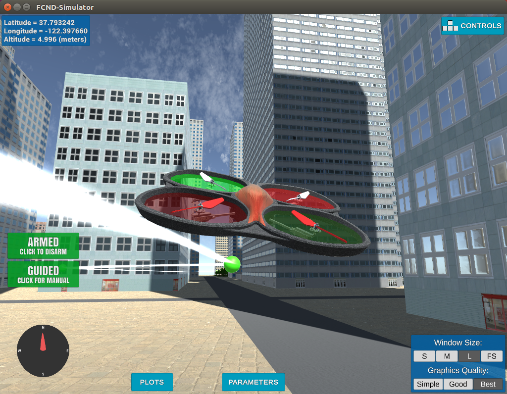
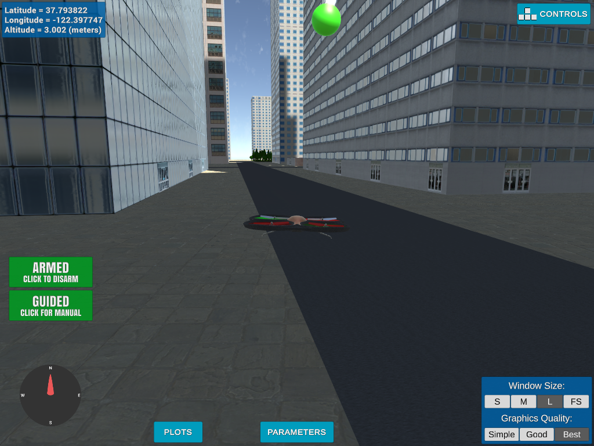
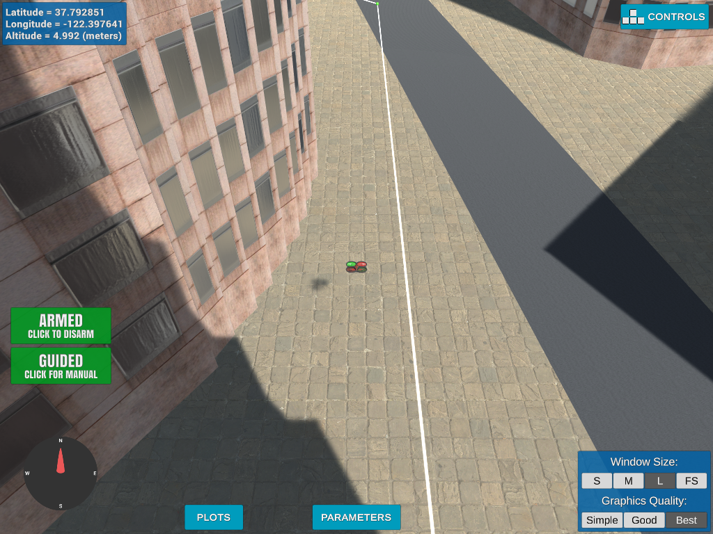
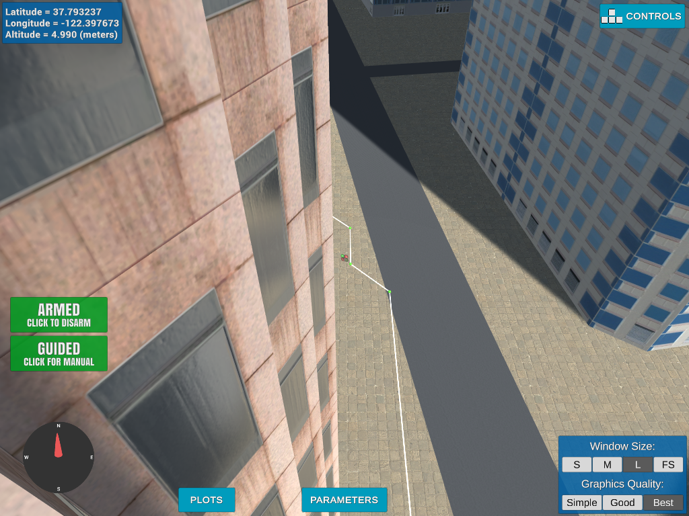

## Project: 3D Motion Planning


---


# Required Steps for a Passing Submission:
1. Load the 2.5D map in the colliders.csv file describing the environment.
2. Discretize the environment into a grid or graph representation.
3. Define the start and goal locations.
4. Perform a search using A* or other search algorithm.
5. Use a collinearity test or ray tracing method (like Bresenham) to remove unnecessary waypoints.
6. Return waypoints in local ECEF coordinates (format for `self.all_waypoints` is [N, E, altitude, heading], where the drone’s start location corresponds to [0, 0, 0, 0].
7. Write it up.
8. Congratulations!  Your Done!

## [Rubric](https://review.udacity.com/#!/rubrics/1534/view) Points
### Here I will consider the rubric points individually and describe how I addressed each point in my implementation.  

---
### Writeup / README
This is the writeup for the Motion Planning Project. The goal is to plan a flight path through a part of San Francisco using a listing of building data to create
a grid map that is then used to create the plan.

A photo of the area that was mapped.


### Explain the Starter Code

The starter code is modified form the backyard planning code.  It instantiates the Drone class and then creates the 
callback functions that are used when the Drone object experiences state changes. 

#### 1. Explain the functionality of what's provided in `motion_planning.py` and `planning_utils.py`

The `motion_planning.py` scripts contains all of the functionality for the drone to fly. It creates the drone object, configures state tracking,
and controls the flight process. The `planning_utils.py` script contains functions that are used by `motion_planning.py`. 
These functions create the grid form the .csv file data and perform the a_star algorithm on the grid. It also include the heuristic used by the a_star function.

An image of the drone in flight.



### Implementing Your Path Planning Algorithm

#### 1. Set your global home position
Here students should read the first line of the csv file, extract lat0 and lon0 as floating point values and use the 
self.set_home_position() method to set global home.  Explain briefly how you accomplished this in your code.

The following code was used to accomplish this requirement.
```python
filename = 'colliders.csv'

        # TODO: read lat0, lon0 from colliders into floating point values
        with open(filename) as f:
            x, y = f.readline().split(',')
        _, x = x.split(' ')
        _, y = y.lstrip().split(' ')
        lat0 = float(x)
        lon0 = float(y)


        # TODO: set home position to (lon0, lat0, 0)
        self.set_home_position(lon0, lat0, 0.0)

```
The filename variable was set to 'filenames.csv'. The file was then opened and the firstline was read into memeory. The line was 
split into two values on the comma separator. The resulting values were then split on the space character with the numenrical 
values returned. Thevalues were then  saved as floats into lat0 and lon0.  To set the home position for the drone, the set_home_position 
method was called with the lon0, lat0, and altitude of 0.0 as parameters.

#### 2. Set your current local position
Here as long as you successfully determine your local position relative to global home you'll be all set. Explain briefly how you accomplished this in your code.

The following code was used to accomplish this requirement.
```python
global_position = np.array([self._longitude, self._latitude, self._altitude])
```
A global position was set by using the drone's values of latitiude, longitutde and altitude.

This code then converted the global position into a local position.
```python
current_local_position = []
current_local_position = global_to_local(global_position, self.global_home)
```

A landing occuring.




#### 3. Set grid start position from local position
The start position was determined by using the `current_local_postion_value` and values returned form the `create_grid` utility function.

```python
grid, north_offset, east_offset = create_grid(data, TARGET_ALTITUDE, SAFETY_DISTANCE)
print("North offset = {0}, east offset = {1}".format(north_offset, east_offset))

north_start = int(current_local_position[0])
east_start = int(current_local_position[1])

grid_start = ((north_start - north_offset), (east_start - east_offset))

```

The `create_grid `function returned offsets that gave the ceter of the grid map. The `global_to_local` method returns a tuple with 
the latitude and longitude of the drone. By subtracting the offset from the current location the grid starting p oint can be determined.


#### 4. Set grid goal position from geodetic coords
This step is to add flexibility to the desired goal location. Should be able to choose any (lat, lon) within the map and have it rendered to a goal location on the grid.

A list of goals was created by using google maps. Theses are in latitude and longitude coordinates. An np array was created using the 
latitude, longitude ans altitude of 0.0. This was then conveted to a local coordinate using the `global_to_local` method. 
The grid_goal was created by using the results from the method and subtracting the grid offsets.

```python
goal_list = [(37.796595, -122.395927), (37.793837, -122.397745), (37.796232, -122.396640), (37.792482, -122.398938), (37.796713, -122.401216)]

goal_lon = goal_list[1][1]
goal_lat = goal_list[1][0]

goal_position = np.array([goal_lon, goal_lat, 0.0])
goal_local_position = global_to_local(goal_position, self.global_home)

grid_goal = (int(goal_local_position[0]) - north_offset,
             int(goal_local_position[1]) - east_offset)
```

#### 5. Modify A* to include diagonal motion (or replace A* altogether)
This requirement solution was acheived by modifications to code in the `planning_utils.py` file. In the `Action` class cost functions were added for diagonal movement.

```python
    NORTH_WEST = (-1, -1, np.sqrt(2))
    NORTH_EAST = (-1, 1, np.sqrt(2))
    SOUTH_WEST = (1, -1, np.sqrt(2))
    SOUTH_EAST = (1, 1, np.sqrt(2))
```

Then to utilize these costs during A-star, code was added to the `valid_actions` function so diagonal movement would be considered.

```python
        valid_actions.remove(Action.EAST)
    if (x - 1 < 0 or y - 1 < 0) or grid[x - 1, y - 1] == 1:
        valid_actions.remove(Action.NORTH_WEST)
    if (x - 1 < 0 or y + 1 > m) or grid[x - 1, y + 1] == 1:
        valid_actions.remove(Action.NORTH_EAST)
    if (x + 1 > n or y - 1 < 0) or grid[x + 1, y - 1] == 1:
        valid_actions.remove(Action.SOUTH_WEST)
    if (x + 1 > n or y + 1 > m) or grid[x + 1, y + 1] == 1:
        valid_actions.remove(Action.SOUTH_EAST)
```

#### 6. Cull waypoints 
For this step you can use a collinearity test or ray tracing method like Bresenham. The idea is simply to prune your path of unnecessary waypoints. Explain the code you used to accomplish this step.

Waypoints were pruned using a collinearity test. The code is not shown here for brevitys sake, but is visible in the `planning_utils.py`. 
The relevant functions are `point, collinearity_check  and prune_path` A sinlge call is made from the `motion_planning.py` script to get the results.

```python
path = prune_path(path)
```
`

### Execute the flight
#### 1. Does it work?
Flying Photos







### Double check that you've met specifications for each of the [rubric](https://review.udacity.com/#!/rubrics/1534/view) points.
  
# Extra Challenges: Real World Planning

For an extra challenge, consider implementing some of the techniques described in the "Real World Planning" lesson. You could try implementing a vehicle model to take dynamic constraints into account, or implement a replanning method to invoke if you get off course or encounter unexpected obstacles.


